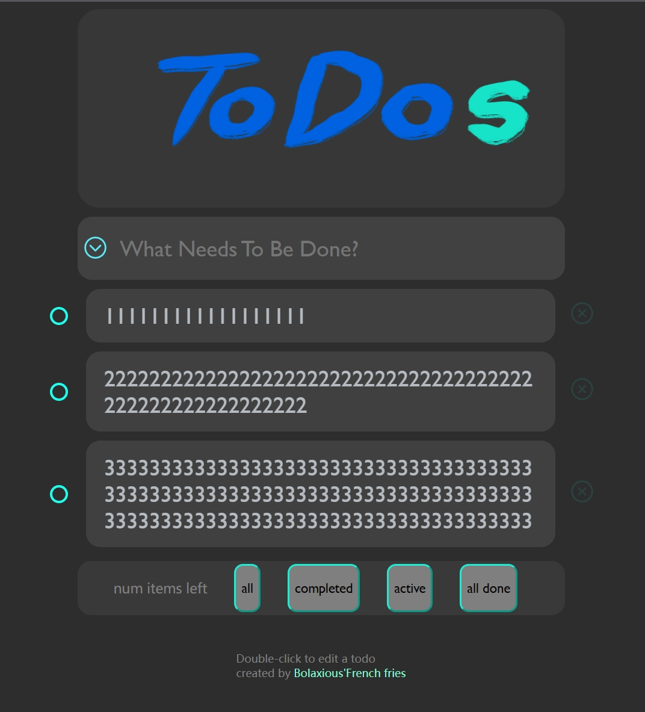

# 新人任务
## 10/17 看完了1、2章
### script元素
1. 插入方式
- 行内（用的少）
- 外部引入（head里面或者放在body部分末尾，一般选择后者）
2. 属性
- defer（推迟）
- async（异步，task2中会提到）
3. noscript

等等等等
### 小结：概念性的东西有点多，一些新的概念确实令人眼花缭乱。但关键是从第3章开始学基本语法。1，2章可以看小结。

## 10/18 没去1006，把todos的外壳做了大部分，利用css实现了部分静态交互
### 实现效果
- checkbox做了点小巧思
- 叉叉放在事项的外面了，透明度做到最低，鼠标浮动到相对的部分则会逐渐高亮，避免了实例中叉叉会遮挡字的问题（当然我觉得这样更好看）
- 全部删除有必要点击所有checkbox后才显现吗？感觉没必要，暂且不做

## 10/19 目前需要解决的问题：

### 1.交互/样式问题
- 点击左侧checkbox后，使page中的文字上显示删除线（这个必须做，需要js里的监听器？？？）（能否尝试改变删除线的样式？想把删除线做成青色来符合整个web的主题，能的话我想在check后实现page中的模糊效果）
- input部分的左侧图标目前还不能被点击，所以需要用js来赋予其作用
- 可以尝试做一个调换主题的按钮吗？（想做一个bingyan主题：橙白红）

- 底栏按钮是否可以实现比较好看的交互效果？（次要）
- 输入框需要设计交互吗？（虽然感觉没什么必要） 

###  2.存储/js效果问题（important！！！）
- 如何实现输入后点enter后事项可以存储下来？
- 如何实现下列四个按钮的作用？（全部删除一定需要点击head部分的ions才显现出来吗？感觉不是很必要）
- 浏览器存储？实例网页可以在退出浏览器后仍然保存上次填的数据
- 双击改变文本？可能需要把page改成input框格后enter再改为page，并且需要位置不变（鑫哥说这玩意有点难）

### 3.不理解之处
- 示例网页中的底栏active按钮有啥用？？？？？？？？？？
- 目前看来，似乎是底部的功能按钮停在all时，点击input框格按钮可以全选pagegroup里的pages，使checkbox全部填满；按钮停在active时，点击input按钮可以使todos表单折叠

### 4.还想实现的功能
- 侧栏处（网页右端）希望可有数个浮动的框格
- 定时提醒功能（通过侧栏框格来实现定时间，进而提醒：不过这个可能涉及到登录功能以及自动提醒的功能）
- 树状图部分？用户可以设置一个大事件还有数个小事件，系统可以把这几个事件组合并通过右端侧栏显示（降低一些要求，如何实现输入事件时可以让用户自己来输入这种树状todos？那么就需要搭建一个这样的环境）

